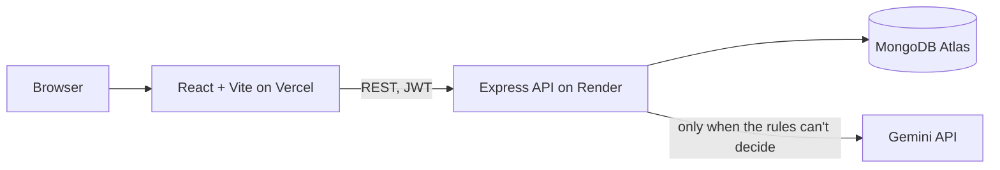
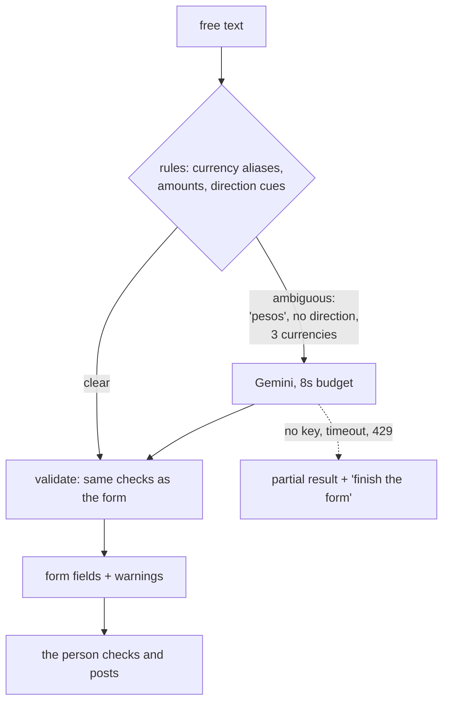

# Swap

Swap helps two people trade leftover foreign cash with each other, in person. Someone posts what they
hold and what they want for it ("3,000,000 COP → 1,050 CAD"), someone else sends a request with a note,
and once the poster accepts, both sides see each other's email and arrange the meetup themselves.

Swap never holds money, charges no fee, and looks up no exchange rate. Every rate shown is the poster's
own arithmetic on their own two amounts.

- **Live app:** _(add the Vercel URL)_
- **API:** _(add the Render URL)_ · health check at `/health`

## What's in v1

- **Accounts:** register, log in, session restore, route guards, log out (JWT).
- **Offers:** post an offer with both amounts, browse open offers, filter by currency pair, search, delete your own.
- **Swap Requests:** request an offer with a short note; the owner accepts or declines, the requester can cancel. **The counterpart's email is released by the server only after an accept**, and accepting an offer declines the other pending requests on it.
- **Paste an offer:** type "j'ai 250 euros, je cherche 370 dollars canadiens" and the form fills itself. It never posts on its own.
- **Ask Swap:** one assistant for the whole app. It fills the offer form, searches offers for a currency, or ranks open offers against what you have and want, with reasons taken from the two posters' own numbers.

Deliberately not built: chat, ratings, verification badges, distance or "traders nearby", and market rates. None of them exist, so nothing in the interface implies they do.

## How it fits together



**Reading text into an offer** is the part worth knowing about:



Rules first because they are free, predictable and testable. The model is asked only about what the rules
can't settle, and **everything it returns is validated afterwards**: an amount that appears nowhere in the
text is dropped, and a currency it picked from an ambiguous word is kept with a warning that says so. If
the model is unavailable, the form still works.

## Running it locally

Requires Node 20+ and a MongoDB (local `mongod` or an Atlas URI).

```bash
# API
cd backend
cp .env.example .env        # fill in MONGO_URI and JWT_SECRET
npm install
npm run dev                 # http://localhost:3001

# Web
cd ../frontend
cp .env.example .env        # VITE_API_URL=http://localhost:3001
npm install
npm run dev                 # http://localhost:5173
```

Demo data (only ever touches the accounts it creates, and prints the database host first):

```bash
cd backend
SEED_CONFIRM=yes npm run seed
```

### Environment variables

| Where | Name | Required | What it does |
| --- | --- | --- | --- |
| backend | `MONGO_URI` | yes | MongoDB connection string. The server exits at startup without it. |
| backend | `JWT_SECRET` | yes | Signs session tokens. Use a long random string, and a different one in production. |
| backend | `CLIENT_ORIGIN` | in production | Comma-separated origins allowed by CORS. Defaults to `http://localhost:5173`. |
| backend | `PORT` | no | Defaults to 3001. Render sets this itself. |
| backend | `GEMINI_API_KEY` | no | Enables the AI fallback. Without it, the rules still parse and the user finishes the form. |
| backend | `GEMINI_MODEL` | no | Defaults to `gemini-3.6-flash`, falling back to `gemini-3.5-flash-lite` when that is overloaded. |
| backend | `SEED_PASSWORD` | no | Password given to seeded demo accounts. |
| frontend | `VITE_API_URL` | yes | Base URL of the API. |

## Checks

```bash
cd backend
npm run eval:parser              # 28 text cases, rules only: no network, no database
npm run eval:parser -- --llm     # the same cases through the AI fallback
npm run eval:assistant           # 18 cases: intent routing and match ranking

cd ../frontend
npm run lint && npm run build
```

The evals are the guard rail for the parser: rules cases must come back exactly right, and ambiguous
ones must come back flagged rather than quietly wrong. Run them before changing a rule or a prompt.

## Troubleshooting

**The app loads but nothing works, and the console says CORS.**
`CLIENT_ORIGIN` on the API doesn't list the frontend's exact origin (scheme, host and port all count).
Set it to the deployed URL, comma-separate several, and redeploy. `curl` will keep working the whole
time, because only browsers enforce this.

**The first request after a while takes ~50 seconds.**
Render's free tier sleeps an idle service. The wait is the cold start. Open `/health` first to wake it
before a demo.

**"Couldn't fill everything automatically" on every ambiguous paste.**
The AI fallback isn't answering. The server logs one line per failure with the model and status:
`401/403` is a bad key, `404` is a model name that key can't use (they get retired), `429` is the free
tier's per-minute limit, `timeout` is the 8 second budget. The rules keep working regardless.

**Logged out after a refresh.**
Tokens last 12 hours, and any 401 clears the stored token. Logging in again is the fix; a changed
`JWT_SECRET` invalidates every existing token.

**`Cannot find module 'bcrypt'`.**
The dependency is `bcryptjs`. If an import says `bcrypt`, a `node_modules` folder in a parent directory
is supplying it locally, and a clean install elsewhere will fail.

**Offers or requests are missing after a deploy.**
Check `/health` for `{"ok":true,"mongo":1}`, then confirm the API is pointed at the database you think
it is. Atlas pauses idle free clusters, and a paused cluster's DNS stops resolving, which looks like a
deleted one.

Every error response carries a `reqId`, and the same id is on the server's log line for that request.

## Repo layout

```
backend/
  controllers/     auth, offers, requests, assistant
  services/        offerParser.js (rules), llm.js (the only file naming a provider),
                   assistant.js (intents), matching.js (ranking), ownerProfiles.js
  utils/           currencies.js, validateOffer.js (shared by the form and the parser), llmQuota.js
  middleware/      authMiddleware.js, requestLogger.js
  scripts/         eval-parser.js, eval-assistant.js, seed.js, *-fixtures.json
frontend/src/
  pages/           LandingPage, BrowsePage (offers), OfferPage (post), RequestsPage
  AssistantPanel.jsx, TopMenu.jsx (sidebar), ui.jsx (shared components), styles.css
DESIGN.md          the design system
PRODUCT.md         what Swap is allowed to claim
DEBUG_LOG.md       real bugs: symptom, what was checked, cause, fix
```
